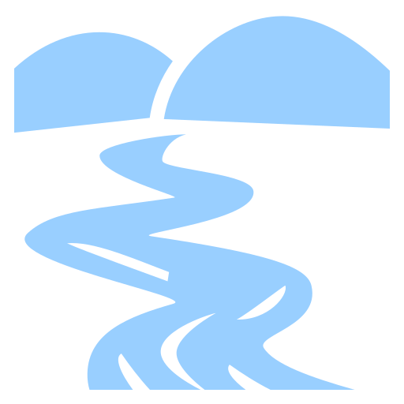
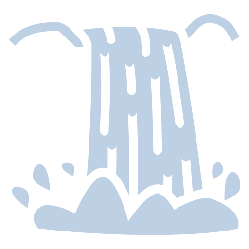
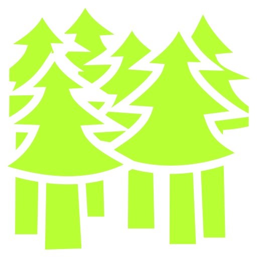

# GMK - PF2e: Golarion
Hexploration Maps of Golarion's Inner Sea Region from Pathfinder.

**(This page is a Work-In-Progress)**

# Content

Maps
- Inner Sea Region
- Darklands
  - Nar Voth
  - Sekamina
  - Orv

Features
- Map Pins (incl. Blank Journal Entries)
- Inner Sea Region Overlays
  - Regional Borders
  - Trade Routes

References / Resources
- Maps
  - Inner Sea Poster Map Folio
  - Pathfinder Campaign Setting: Inner Sea Poster Map Folio
  - Golarion World Map
  - PF1e: Inner Sea World Guide

(THIS PAGE IS A WIP)

# Active Development

Currently investigating the potential for splitting the maps into their PF2e Regions; of ...
- Abasalom
- Broken Lands
- Eye of Dread
- Golden Road
- High Seas
- Impossible Lands
- Mwangi Expanse
- Old Cheliax
- Saga Lands
- Shining Kingdoms

Alternative importable versions of the map, using the Adventure Importer, which would allow for "Templated Content", such as short snippets of info about locations, or Nation / City Statblocks.

# Homebrewing & Content Customisation Guide

(WIP; updating as development continues.)

TLDR; I use custom-written scripts to mass-edit content. i.e. I can update all settlements, or geographical features, quickly -- ensuring unformity of content. This scripts are crude, and not fit for wider release. I am investigating the possibility of tools which could help user-customisation of the content. i.e. if you disagree all islands should be X colour!

Map Pins have icons, colours, and are scaled according to their associated locations.

Below is a WIP section detailing the different types of common icons and their meaning.

| Settlement | Icon | Size (px) |
| :--------- | :---: | :---: |
| Thorp | x | 32 |
| Hamlet | x | 32 |
| Small Village | x | 32 |
| Village | x | 40 |
| Large Village | x | 40 |
| Small Town | x | 40 |
| Town | x | 50 |
| Large Town | x | 50 |
| Small City | x | 60 |
| Large City | x | 70 |
| Metropolis | x | 80 |

| Geograhical Feature | Icon | Size (px) |
| :--------- | :---: | :---: |
| River |  | 32 |
| Waterfall |  | 32 |
| Mountain | x | 50 |
| Forest |  | 50 |
| Jungle | x | 50 |
| Hill | x | 50 |
| Island | x | 50 |
| Cave | x | 32 |
| Ruin | x | 32 |
| Volcano | x | 40 |
| Coast | x | 40 |
| Swamp | x | 40 |
| Oasi | x | 40 |
| Grassland | x | 40 |
| Desert | x | 60 |

Other Points of Interest, currently Icon Size = 40

**Homebrew Map Pins**

It is suggested that a level be created, keeping the base map visible.
Then any user-created pins should be put on this new layer.
This ensures that as the number of user-created pins expands, it doesn't become an issue.

## File Optimization Tips. (WIP SECTION)

This FoundryVTT module includes high resolution maps, of which not all may be required during gameplay.
To further optimize the module, and remove maps you do not require ...
- First, lock the module on the FVTT Modules Management Homepage by right-clicking.
- Navigate to ... "Foundry User Data/Data/modules/gmk-pf2e-golarion/assets/scenes"
- Remove only those files you do not wish to use.

You may delete the levels associated with the maps you have removed in FoundryVTT Scene Management.

# Licensing & Attribution

> **Paizo Inc. Community Use Policy**
> 
> This FoundryVTT Module uses trademarks and/or copyrights owned by Paizo Inc., used under Paizo's Community Use Policy (paizo.com/licenses/communityuse). We are expressly prohibited from charging you to use or access this content. This FoundryVTT Module is not published, endorsed, or specifically approved by Paizo. For more information about Paizo Inc. and Paizo products, visit paizo.com.
